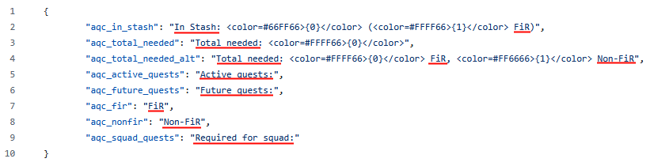

# Translating Guide
This is a short guide on how to translate this mod.

## What languages are supported?
Every language that is supported by SPT can be added to this mod.

## Setting up
1. Make sure you are logged into GitHub
2. Fork this repository (White button on the top of the page with text 'Fork')
3. In next screen press `Create fork`
4. Navigate to `locales` directory
5. Open `en.json` file and copy its content
6. Go back and press 'Add File' button then 'Create new file'
7. Write in 'Name your file...' field your language code followed by `.json` (list of all available languages can be found in your game directory in `SPT_Data/Server/database/locales/global`)
8. Paste text copied from `en.json`

## Translating
* You have to translate text in every line that is present after `:` symbol
* Do not edit text inside `<>` or `{}`
* Things you need to translate are underlined in image below

## Finishing
1. Save your file by pressing green button `Commit changes`
2. Give nice name to your commit e.g. `Add X language` and press `Commit changes`
3. Above file list you should see button `Contribute` - press it and then press `Open pull request`
4. Make sure that name of pull request is correct and press `Create pull request`
5. Wait for me to accept your pull request